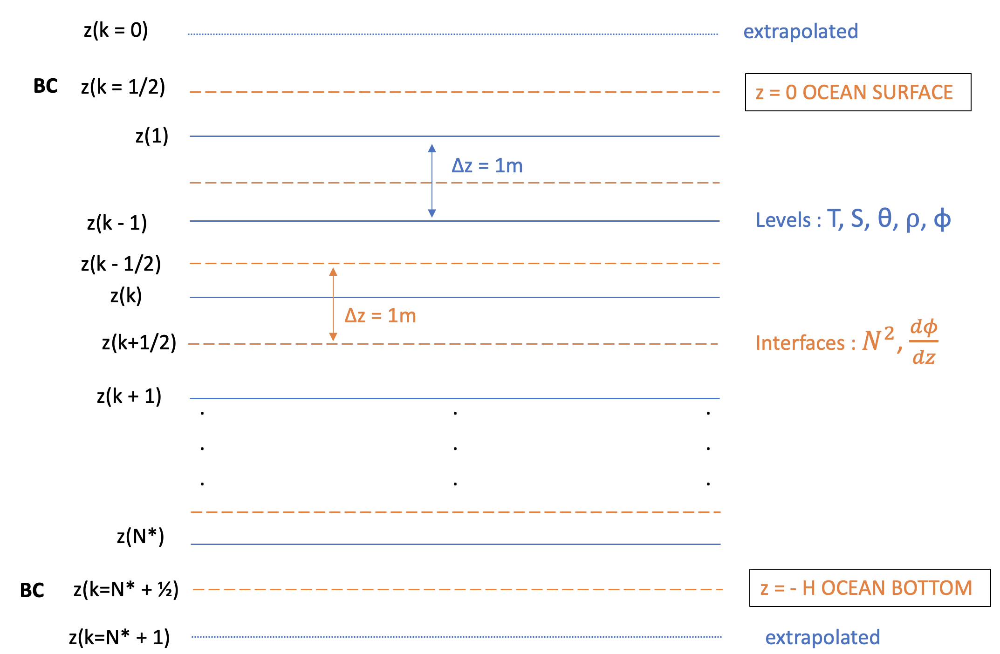
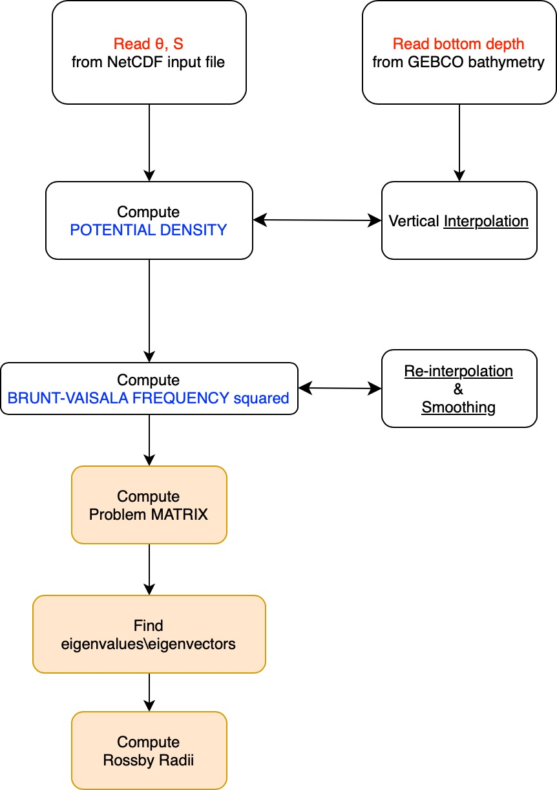

# Numerical Resolution

To solve numerically the **vertical structure function equation**
\[
\frac{d}{dz}\Big(\frac{{f_0}^2}{{N_s}^2}\frac{d\Phi_n}{dz}\Big) = - \lambda_n \Phi_n
\]
with
\[
{N_s}^2 = \frac{g}{\rho^*}\frac{d\rho_s}{dz}\quad (\rho^*=1025\frac{kg}{m^3}),
\]

we use a *Charney-Phillips staggered grid* (Fig. 1). 

On the one hand, a number of vertical levels is defined, where the integer values ($k=1,2,\dots N^*$) are the levels on which the ocean variables are defined (in-situ or potential temperature, salinity, potential density). The first level $k=1$ will be the first value/data available below the sea surface, while the last level $k=N^*$ will be the last value/data available above the sea bottom.

On the other hand, on the interfaces corresponding to fractional values ($k=\frac{1}{2},\frac{3}{2},\dots N^*+\frac{1}{2}$), we define the Brunt-Vaisala Frequency squared ${N}^2$ and the derivatives of the vertical structure function $\frac{d\Phi}{dz}$. The first interface $k=\frac{1}{2}$ corresponds to the sea surface, while the last interface $k=N^* +  \frac{1}{2}$ to the sea bottom. This way, we can apply the BCs.

Both levels and interfaces are equally spaced with grid step $\Delta z = 1m$.

**Figure 1:** Scheme of the Charney-Phillips staggered grid used for numerical resolution.

## Software Workflow

The software workflow is described in Fig. 2.

1. Potential temperature and salinity are read from user-provided NetCDF files. If in-situ temperature is provided, potential temperature can be computed using the software tools.
2. Bathymetry is read from GEBCO 2023 dataset.
3. Potential density is interpolated on the Charney-Phillips levels (1m grid step), from $k = 1 $ up to $k = N^* $. In addition, it is extrapolated on two extra levels: $k=0$ and $k=N^* + 1$. These two levels correspond to values/data respectively slightly above the sea surface and slightly below the sea bottom. These values will be used for computing $N^2$ at the sea surface and sea bottom interfaces.
4. The Brunt-Vaisala frequency squared is computed using the following centered differences equation:

   $$
   {N^2}_{k+1/2} = - \frac{g}{\rho^*}\frac{\rho_{k}-\rho_{k+1}}{\Delta z}\qquad \Delta z = 1m
   $$

   so that $N^2$ is defined on the interfaces while computed from variables defined on the levels.

5. Negative values of $N^2$ (due to instabilities) are removed. $N^2$ is re-interpolated on the interfaces (to fill the gaps), and smoothed using a low-pass filter to avoid unrealistic spikes.
6. The problem matrix is computed, so that:

   $$
   \mathcal{A}
   \begin{bmatrix}
   \Phi_1\\\Phi_2\\\vdots\\\Phi_{N^*}
   \end{bmatrix}
   = -\lambda
   \begin{bmatrix}
   \Phi_1\\\Phi_2\\\vdots\\\Phi_{N^*} 
   \end{bmatrix}
   $$

   where:

   $$
   \mathcal{A} = \frac{{f_0}^2}{\Delta z^2} \begin{bmatrix}
   -\frac{1}{N^2(\frac{3}{2})}&\frac{1}{N^2(\frac{3}{2})}&\dots&0\\
   \frac{1}{N^2(\frac{3}{2})}&-\frac{1}{N^2(\frac{3}{2})} - \frac{1}{N^2(\frac{5}{2})}&\frac{1}{N^2(\frac{5}{2})}&0\\
   \vdots&\ddots&\ddots&\vdots \\
   0&\dots& \frac{1}{N^2(N^*-\frac{1}{2})}&-\frac{1}{N^2(N^*-\frac{1}{2})}
   \end{bmatrix}
   $$

   To notice, while the derivatives $\frac{d\Phi}{dz}$ are defined on the interfaces, $\Phi$ itself is defined on the **levels**. Therefore, the number of vertical modes is equal to the number of vertical levels $N^*$. Values at interfaces $k=\frac{1}{2}$ and $k=N^*+\frac{1}{2}$ are not used due to BCs:

\[
\frac{d\Phi}{dz} = 0 \quad \text{at } z = 0,-H \quad. \tag{14}
\]

7. Finally, the eigenvalues/eigenvectors are found using standard libraries (based on LAPACK/DSTEMR routines). The deformation radii are computed according to Eq. \ref{eq:rad}. The vertical structure function is normalized by dividing by its norm:

   $$
   \lVert \Phi_n \rVert = \frac{1}{N^* \Delta z}\int_{z_{N^*}}^{z_1}\Phi_n^2dz
   $$

   so that:

   $$
   \int_{z_{N^*}}^{z_1}\frac{\Phi_n^2}{\lVert \Phi_n \rVert}dz = 1
   $$

8. A plotting tool is provided to visualize results.

**Figure 2:** Scheme of the software workflow.
