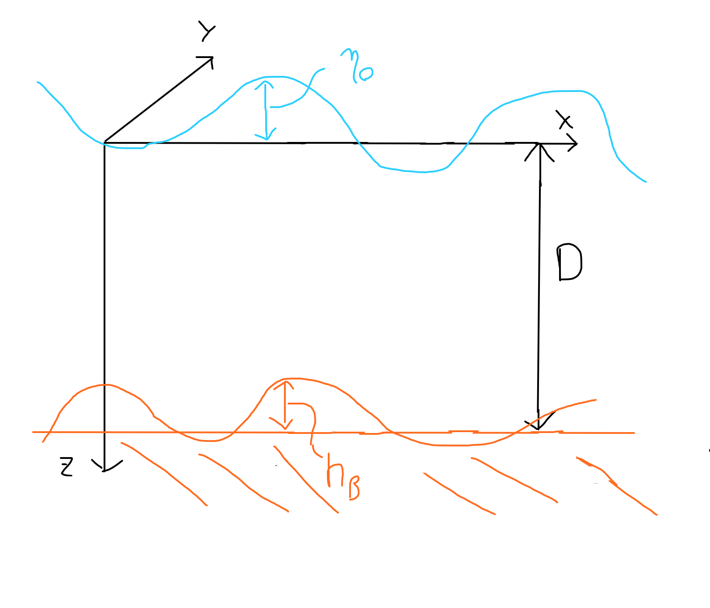

[Francesco M. Benfenati](mailto:francesco.benfenati5@unibo.it)  

---

The purpose of the following document is to describe the theoretical background and the numerical resolution implemented in the software available [here](https://github.com/Francesco-Maria-Benfenati/qgbaroclinic). The software has been developed to compute the Ocean QG baroclinic modes of motion and the baroclinic deformation radii, based on the Temperature and Salinity data provided by the user.

## Theoretical Background: QG Potential-Vorticity Equation for Oceanic Synoptic Scales
The theoretical background has been extrapolated and adapted from Pedlosky [1] and Grilli, Pinardi [2].

### Homogeneous Ocean
From the scaling of the primitive equations, we obtain the **non-dimensional** equation for the QG potential vorticity (for a homogeneous ocean):

\[
\left[\frac{\partial}{\partial t}+ \vec{u_0}\cdot\vec{\nabla}\right]\Big[\xi_0' + \beta'_0 y' - F\eta'_0 + \eta'_B\Big] = 0 \tag{1}
\]

where

\[
\begin{aligned}
    &\vec{u_0} = (u_0,v_0,0), \\
    &F = \frac{{f_0}^2L^2}{gD}, \quad \text{inverse of the Burger number}, \\
    &\epsilon=\frac{U}{f_0L}, \quad \quad \text{(advective) Rossby number}, \\
    &\xi_0 = \frac{U}{L}\xi_0', \quad
    h_B = \epsilon D \eta_B', \quad
    \beta_0 = \frac{U}{L^2}\beta_0', \\
    &y = L y', \quad \eta_0 = \frac{f_0LU}{g}\eta_0'.
\end{aligned}
\]

Here, the superscript `'` is used for "non-dimensional" variables; \(\xi_0\) is the relative vorticity of the geostrophic field, \(\eta_0\) is the free surface elevation with respect to the rest level, \(h_B\) is the bottom variation with respect to the flat bottom; \(\beta_0\) comes from the expansion of the Coriolis parameter: \( f = f_0 + \beta_0 y \).

The subscript \(_0\) refers to the geostrophic approximation. Lastly, \(D\) is the ocean depth in the case of a flat bottom and surface (see Figure 1); \(U, L\) are, respectively, the horizontal velocity and horizontal length scales.

  
**Figure 1:** Ocean scheme, used for defining variables and scaling.

If we now aim to obtain the dimensional equation, we need to substitute the non-dimensional parameters/variables. Therefore, we have:

\[
\begin{aligned}
    &\xi_0' - F\eta_0' + \beta_0' y' + \eta_B' = \text{const}, \\
    &\xi_0' - \frac{{f_0}^2L^2}{gD} \eta_0' + \beta_0' y' + \frac{h_B}{D}\frac{f_0L}{U} = \text{const}, \\
    &(\xi_0'\frac{U}{L}) - \frac{f_0}{D}(\frac{f_0LU}{g}\eta_0') + (\frac{U}{L^2}\beta_0') (Ly') +  f_0\frac{h_B}{D} = \text{const}, \\
    &{\xi_0} - \frac{f_0}{D}{\eta_0} + \beta_0y  + \frac{f_0}{D} h_B = \text{const}.
\end{aligned}
\]

Eventually, the **dimensional** QG potential vorticity equation is:

\[
\boxed{\left[\frac{\partial}{\partial t}+ \vec{u_0}\cdot\vec{\nabla}\right]\Big[\xi_0 + \beta_0 y - f_0\frac{\eta_0 - h_B}{D}\Big] = 0} \tag{2}
\]

\[
\Pi = \xi_0 + \beta_0 y - f_0\frac{\eta_0 - h_B}{D}. \tag{3}
\]

One may consider a different formulation, which may be found in Pedlosky [1] (Eq. 3.17.8):

\[
\Pi = \frac{\xi_0 + f_0 + (\beta_0 y + f_0\frac{h_B}{D}) - f_0\frac{\eta_0}{D}}{D},
\]

which is equivalent to the previous equation, considering that \(D\) and \( f_0 \) are constants.

## Stratified Ocean

For a stratified ocean, we should add to Eq. 2 the vortex-tube stretching term due to stratification effects:

\[
\left[\frac{\partial}{\partial t}+ \vec{u_0}\cdot\vec{\nabla}\right]\Big[\xi_0 + \beta_0 y - f_0\frac{\eta_0 - h_B}{D}\Big] = \frac{f_0}{\rho_s}\frac{\partial}{\partial z}(\rho_s w_1) \quad
\tag{4}
\]

where the right-hand term comes from the continuity equation:

\[
\frac{\partial u_1}{\partial x} + \frac{\partial v_1}{\partial y} + \frac{1}{\rho_s}\frac{\partial}{\partial z}(\rho_s w_1) = 0 \quad; \tag{5}
\]

\( u_1, v_1, w_1 \) are the first-order expansion terms of the velocity components; \( \rho_s \) is the basic state upon which fluctuations due to motion occur, so that the density profile may be described as:

\[
\rho = \rho_s(z)[1 + \epsilon F \rho'] \quad \text{($\rho'$ being non-dimensional),}
\]

\[
\text{with } \rho' = \rho_0' + \epsilon\rho_1' + \dots \qquad\text{($\rho_0'$ non-dimensional).}
\]

Besides, we want to take into account the thermodynamic equation for oceanic motions (considering null heat exchange):

\[
\left[\frac{\partial}{\partial t}+ \vec{u_0}\cdot\vec{\nabla}\right]\rho_0 + \epsilon w_1 \frac{\partial \rho_s}{\partial z} = 0 \quad, \tag{6}
\]

\[
\rho_0 = \rho_s \epsilon F \rho_0' \quad
\]

so that

\[
\left[\frac{\partial}{\partial t}+ \vec{u_0}\cdot\vec{\nabla}\right]\rho_0'D- S w_1  = 0
\tag{7}
\]

with:

\[
S(z) = \frac{{N_s}^2D^2}{{f_0}^2L^2}, \quad {N_s}^2(z) = - \frac{g}{\rho_s}\frac{\partial\rho_s}{\partial z}.
\]

If we now combine Eq.s 4 and 7, neglecting the sea surface and bathymetry contributions to QG potential vorticity (i.e., \( \eta_0, h_B \ll D \)), we obtain:

\[
\left[\frac{\partial}{\partial t}+ \vec{u_0}\cdot\vec{\nabla}\right]\Big[\xi_0 + \beta_0 y - \frac{f_0D}{\rho_s}\frac{\partial}{\partial z}\Big(\rho_s\frac{\rho_0'}{S}\Big) \Big] = 0 \quad.
\tag{8}
\]

If we linearize Eq. 8 and assume the hydrostatic balance of the geostrophic field (i.e., \( \frac{\partial p_0'}{\partial z'} = - \rho_0' \)), we obtain an equation in terms of pressure of the geostrophic field:

\[
\frac{\partial}{\partial t}\Big[\frac{1}{{\rho_0} f_0}{\nabla_0}^2 p_0 + \frac{f_0 D}{\rho_s}\frac{\partial}{\partial z}\Big(\frac{\rho_s}{S}\frac{\partial p_0'}{\partial z'}\Big) \Big] + \frac{1}{{\rho_0} f_0}\beta_0 \frac{\partial p_0}{\partial x} = 0.
\]

\[
\frac{\partial}{\partial t}\Big[{\nabla_0}^2 p_0 + \frac{\rho_0{f_0}^2 D}{\rho_s}\frac{\partial}{\partial z}\Big(\rho_s\frac{{f_0}^2 L^2}{{N_s}^2D^2}\frac{\partial p_0'}{\partial z'}\Big) \Big] + \beta_0 \frac{\partial p_0}{\partial x} = 0.
\]

\[
\frac{\partial}{\partial t}\Big[{\nabla_0}^2 p_0 + \frac{1}{\rho_s}\frac{\partial}{\partial z}\Big(\rho_s\frac{{f_0}^2}{{N_s}^2}\frac{\partial ( \rho_0 {f_0}^2 L^2 p_0')}{\partial (Dz')}\Big) \Big] + \beta_0 \frac{\partial p_0}{\partial x} = 0.
\]

\[
\boxed{\frac{\partial}{\partial t}\Big[{\nabla_0}^2 p_0 + \frac{1}{\rho_s}\frac{\partial}{\partial z}\Big(\rho_s\frac{{f_0}^2}{{N_s}^2}\frac{\partial p_0 }{\partial z}\Big) \Big] + \beta_0 \frac{\partial p_0}{\partial x} = 0.}
\tag{9}
\]

where \( {\nabla_0}^2 = \frac{\partial^2}{\partial x^2} +\frac{\partial^2}{\partial y^2} \), \( z=Dz' \), and \( p_0 = \rho_0 {f_0}^2 L^2 p_0' \).

Decomposing the pressure field into one horizontal, time-dependent part and one vertical part:

\[
p_0(x,y,z,t)\propto \Re\{e^{i(kx+ly-\sigma t)}\} \Phi(z). \tag{10}
\]

Substituting in Eq. 9, we obtain the **vertical structure equation**:

\[
\frac{1}{\rho_s}\frac{d}{dz}\Big(\rho_s\frac{{f_0}^2}{{N_s}^2}\frac{d\Phi}{dz}\Big) = - \lambda \Phi, \tag{11}
\]

where:

\[
\lambda = - \Big(\frac{\beta_0 k}{\sigma} + k^2 + l^2\Big).
\]

In our software, we resolve Eq. 9 assuming the **Boussinesq approximation**, i.e., considering \( \rho_s(z) = \rho^* = 1025 \frac{kg}{m^3} \) constant when not multiplied by \( g \). Eventually, the equation solved is:

\[
\frac{d}{dz}\Big(\frac{{f_0}^2}{{N_s}^2}\frac{d\Phi_n}{dz}\Big) = - \lambda_n \Phi_n, \tag{12}
\]

where:

\[
{N_s}^2 = \frac{g}{\rho^*}\frac{d\rho_s}{dz}.
\]

Eq. 12 is solved to find each eigenvalue/eigenvector \( n=0,1,\dots N^* \) (where \( N^* \) is the number of vertical layers considered). While \( \Phi_n \) is the vertical structure function for each mode, we use the eigenvalues to compute the **baroclinic deformation radius \( R_n \)** for each mode, defined as:

\[
R_n = \frac{1}{\sqrt{\lambda_n}}\quad. \tag{13}
\]

The Boundary Conditions (BCs) applied to Eq.s 11 and 12 are:

\[
\frac{\partial^2p_0}{\partial t\partial z} = 0 \quad\text{i.e.}\quad \frac{d\Phi}{dz} = 0 \quad \text{at } z =0,-H \quad. \tag{14}
\]

### References

1. **Pedlosky, J.** (1992). *Geophysical Fluid Dynamics*. Springer New York. ISBN: 9780387963877. Available at: [https://books.google.com/books?id=FXs-uRSDBFYC](https://books.google.com/books?id=FXs-uRSDBFYC).

2. **Grilli, F., & Pinardi, N.** (1999). *Le Cause Dinamiche della Stratificazione Verticale nel Mediterraneo*. Technical Report 3, ISAO, CNR. (Cited on pp. 25–27).
